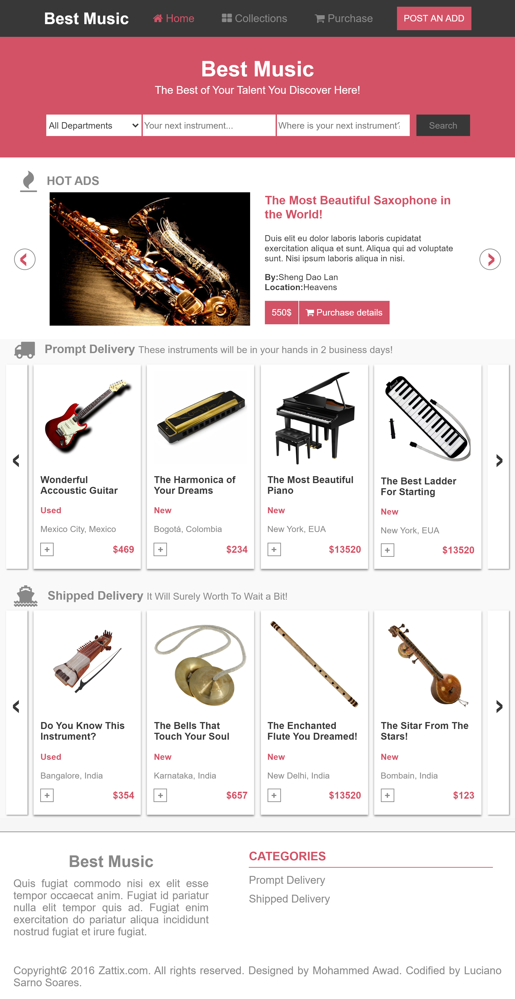

# Capstone Project (Online shop)

> This is my Capstone Project for the HTML&CSS3 module of the Microverse course. In this project, I was required to create an Online Shop Website according to the specifications on https://www.behance.net/gallery/24796463/ZATTIX.

## Built With

- HTML,
- CSS3,

## Live Demo

[Live Demo Link](https://rawcdn.githack.com/lucianosarno/htmlCssCapstone/64d89a566942ec217abc4352fdceb515971812cd/index.html)

## Author

👤 Luciano Sarno

- Github: [@lucianosarno](https://github.com/lucianosarno)
- Linkedin: [@ls-soares](https://www.linkedin.com/in/ls-soares/)
- Twitter: [@Luciano68238988](https://twitter.com/Luciano68238988)

## 🤝 Contributing

Contributions, issues, and feature requests are welcome!

Feel free to check the [issues page](issues/).

## Show your support

Give a ⭐️ if you like this project!

## Acknowledgments

- Microverse
- GitHub

## 📝 License

This project is open-licensed.

## 📝 Credits

This project is based on Zattix design created by Mohammed Awad (https://www.behance.net/gallery/24796463/ZATTIX)
